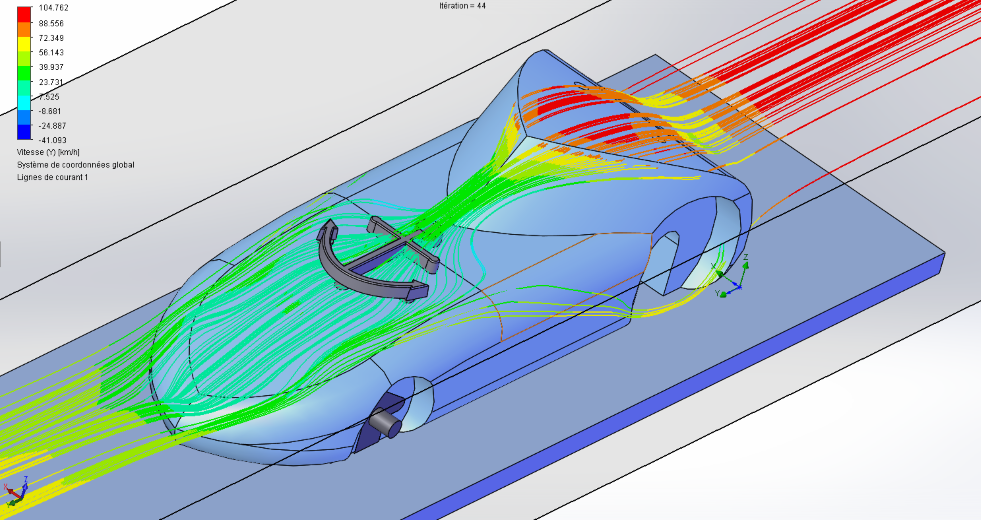

# Grand Oral : Architecture du véhicule 
### Problématique : 
## Plan :
- Introduction
- Partie Théorique
- Application
- Conclusion
## Introduction :
Bonjour, je vais vous parler pour mon sujet de Grand Oral de l'aérodynamique. Tout d'abord, pourquoi ce sujet ? Dans le cadre d'un projet de SI qui s'intitule "course en cours", j'ai dû avec mon équipe, créer une voiture miniature et élaborer un stand, des tenues,... On s'était donc réparti les rôles et je me chargeais de l'architecture et du design du projet. Cette partie était utile pour le coté visuel mais aussi pour son impact sur l'aérodynamique et la répartition des charges. Comme dit précédemment, je compte aborder le thème de l'aérodynamique cependant est ce que l'étude de l'aérodynamique permet d'avoir un gain d'accélération dans le cadre de course en cours ?
Pour travailler sur l'aérodynamique, il faut étudier la force de trainée qui s'applique sur l'axe $\overrightarrow{x}$, et la force de portance (sur l'axe $\overrightarrow{y}$) ce sont les forces appliquées sur le véhicule par le fluide dans lequel il se déplace. Il faut tout d'abord établir l'équation de la trainée qui se définit par la trainée est égale a la moitié du coefficient de trainée fois la masse volumique fois le carré de la vitesse fois la surface de référence. Et pour la portance, c'est la même formule en remplaçant le coefficient de trainée par le coefficient de portance. On va donc étudier les variables afin de minimiser la force de trainée et de portance :
## Partie théorique :
### Coefficient de Trainée :
On commence par le coefficient de trainée noté Cx, tout d'abord, qu'est ce que c'est que ce coefficient ? C'est une classification appliquée pour la resistance aérodynamique d'un voiture par exemple, qui est définie par la forme de la surface avant de la voiture (en tres grande partie). Ce qui veut dire q'une surface plane n'aura pas le même coefficient de trainée, la même resistance aérodynamique qu'une surface sphèrique. De plus, cette valeur doit être la plus petite possible afin d'avoir une trainée moins élevée. Pour donner un ordre d'idée, une forme de cuve arrondie a le coefficient le plus élevé avec 2.30, ça commence à devenir intéressant avec une surface pyramidale qui a un coefficient de 0.50, et enfin la forme la plus intéressante, c'est une forme de goutte allongée, qui a un coefficient de 0.04. Cependant pour une voiture, la forme avec le meilleur coefficient, cest la même forme de goutte mais coupée en deux dans le sens de la longueur, ce qui donne un coef de 0.09. On essaie donc d'atteindre un coefficient de trainée proche de 0.1. Cette force sur une voiture standard a pour effet de surelever l'arrière du véhicule à l'image d'une feuille pliée en deux sur laquelle on soufflerait dessus, et sa face arrière viendrait se soulever. 
### Coefficient de Portance :
Ensuite, le coefficient de portance noté Cz est un autre coefficient aérodynamique mais celui ci a pour but de trouver la portance donc sur l'axe $\overrightarrow{y}$. La particularité de cette force c'est qu'on peut la détourner à notre avantage, grâce à l'ajout d'un aileron mais ça on y reviendra plus tard. Contrairement au coef de trainée qui doit être le plus petit possible, celui ci doit avoir un minimum pour bien plaquer la voiture sur le sol mais ne doit pas être trop élevé sinon la voiture avancera moins vite. Ce coef est dans le même ordre de grandeur que Cx, c'est à dire entre 0 et 2.
### Surface de Référence :
Puis, on a la surface de référence, et qu'est ce que cette surface ? Il s'agit de la surface qui entre en contact avec la force en question (elle permet de la quantifier), pour la trainée par exemple, il s'agit de l'avant de la voiture. Pour la calculer, il faudra prendre environ la hauteur de la voiture fois sa largeur, en l'occurence elle est d'environ 7400mm² soit 0.0074m². et bien evidemment pour réduire la force de trainée, il faudrait diminuer la surface de référence, cependant le plus judicieux pour l'équilibre serait de changer la hauteur et non la largeur.
### Supplément : L'aileron
On va finir cette partie théorique par l'ajout optionnel d'un aileron, tout d'abord il existe deux types d'aileron, un a l'avant (sur lequel on ne va pas s'attarder vu qu'on en a mis qu'un et à l'arrière (par choix estethique)), et par conséquent un à l'arrière qui est composé de plusieurs lames réhaussées et soutenues par deux pieds en appui sur l'arrière. Il a une forme d'aile d'avion dans le sens inverse, ce qui fait que l'air passant sur le coté bombé fait plus de chemin que l'air passant sur le coté plat  et plaque sur le sol la voiture. cet aileron est à l'origine de la majeure partie de l'appui aérodynamique, l'aileron permet d'asseoir le véhicule à haute vitesse et d'éviter le décollement de la voiture qui d'augmenter la trainée. Il a donc un impact sur la portance et elle evoluera selon l'angle de l'aileron. C'est donc là dessus que l'on s'interroge, et c'est pour ça qu'on va passer à l'étape de la modélisation sur Onshape et des tests sur SolidWorks et particulièrement son supplément Workflow Simulation. 
## Application :
### Modélisation :
Afin de pouvoir réaliser notre voiture, il fallait tout d'abord modéliser notre voiture sur Onshape. On a dû tout d'abord modéliser le bloc moteur et le bloc de balsa dans lequel on viendrait tailler le véhicule afin d'établir des limites de taille. Ensuite, on est passé à la réalisation de la voiture et des roues, mais je ne m'attarderai que sur la voiture étant donné que je ne traite pas de l'adhérence. On a donc veillé à bien respecter tous les critères cités précédemment pour avoir les forces de trainée et de portance les plus adéquats. C'est à dire une forme se rapprochant de celle d'une goutte coupée en deux et d'avoir une hauteur minime. Cependant il reste l'aileron qu'on ne peut pas rajouter à la voiture sans le tester. C'est une des raisons pour lesquelles on va transférer notre voiture sur Solidworks.
### Tests :
Pour cette partie de tests, on va la séparer en 2 parties, la première on voit les critères de forces aérodynamiques sans aileron puis avec aileron, pour mieux saisir son impact. 
#### Sans aileron
D'apres WorkFlow simulation qui est un complément de solidworks on a pu voir les lignes de courants qui s'appliquent sur la voiture et on remarque que la force appliquée est plus élevée sur l'arrière de la voiture ce qui provoque un soulèvement du véhicule.

Et aussi d'après cette simulation, la valeur moyenne de la trainée est de 0.115 N pour une vitesse moyenne de 7,5 m/s, ça parait être une bonne trainée mais c'est parce que la vitesse est tres peu élevée et c'est un element important etant donné que le carré de la vitesse rentre en compte. cependant si on calcule le coefficient de on voit qu'il est de 0.46, on le comparera ensuite avec des formes différentes que j'aurai experimentées. Puis on refait la simulation pour la portance qui est donc de 0.041 N, c'est encore plus négligeable soit une mauvaise portance parce qu'on cherche à avoir un minimum de force qui s'applique sur la voiture. Et du coup, le coef de portance est de 0.115.
## Conclusion
comparer avec les autres forces en jeu. repondre a la problematique. ouverture sur l'adhérence
